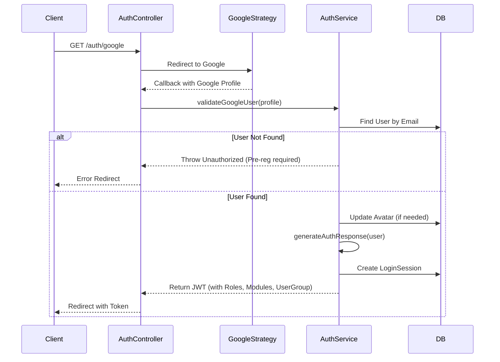
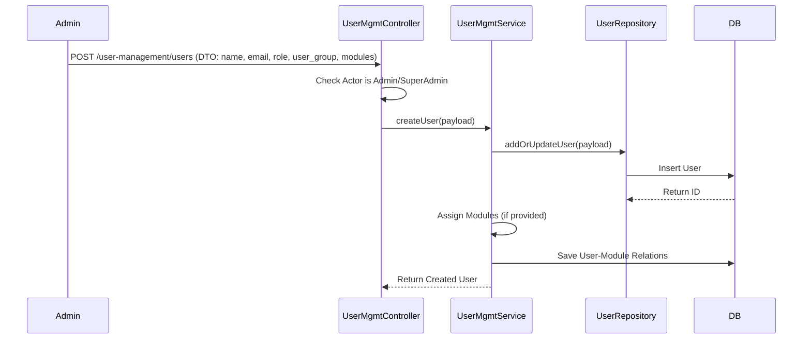
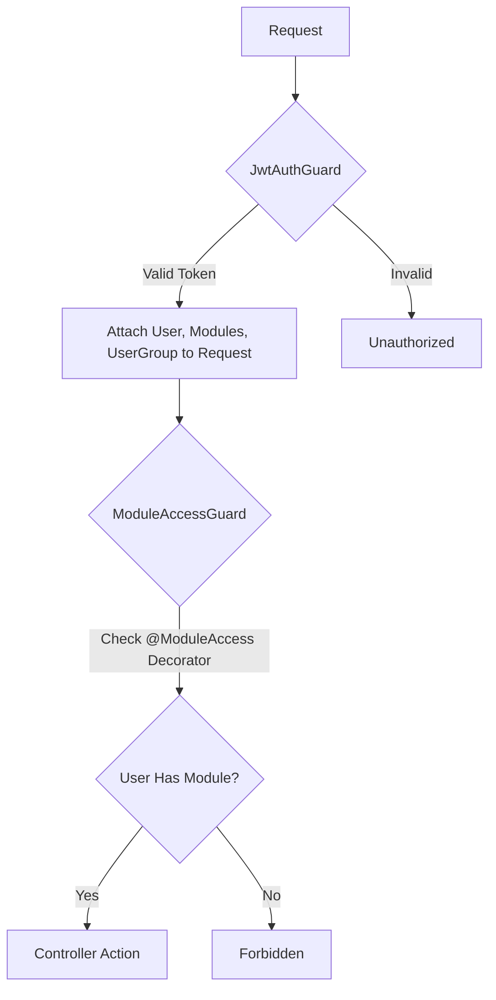
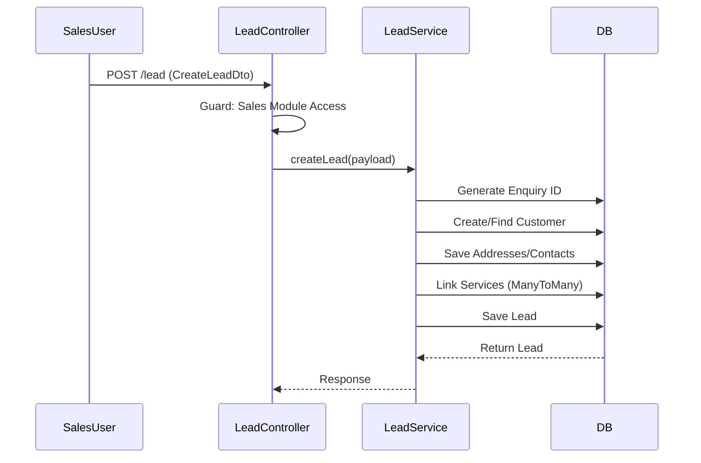
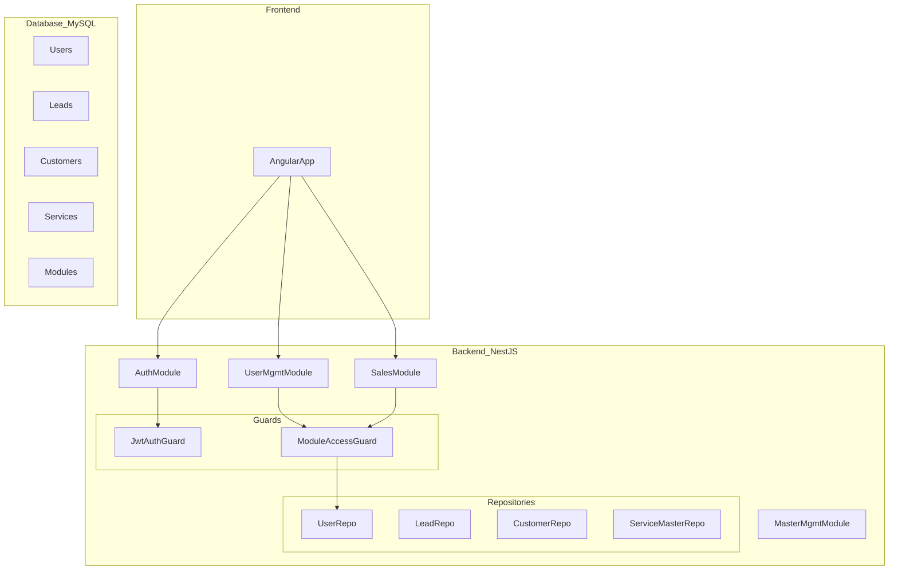

# Project Flow Graph

## 1. Authentication Flow

## 2. User Creation & Module Assignment Flow

## 3. Module Access Control Flow

## 4. Sales / Lead Management Flow

## 5. System Architecture Overview

